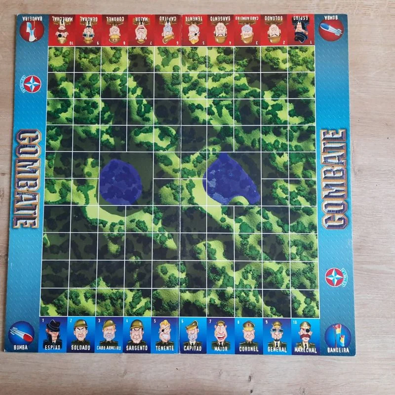
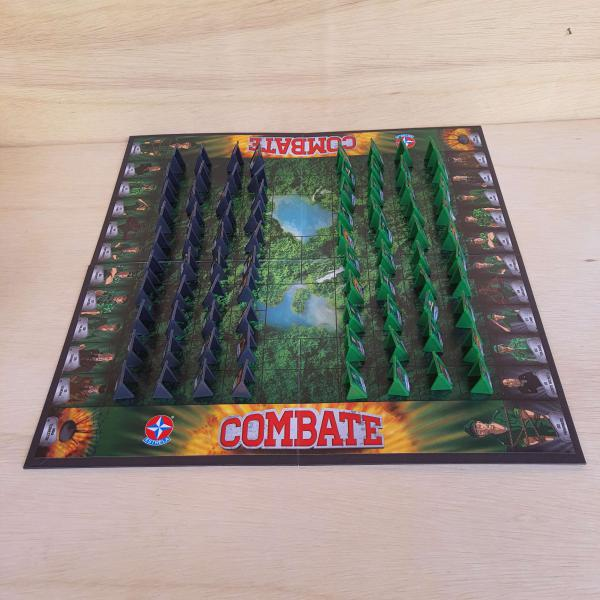

# COMBATE

**Requisitos:** 
- Java na versão 21
- Maven para gerenciamento de dependências e build.

---

## Descrição

O jogo **COMBATE** é um projeto de estratégia que simula batalhas entre jogadores, inspirando-se no [Manual Combate](https://estrela.vteximg.com.br/arquivos/Manual-Combate.pdf) e na [videoaula no YouTube](https://youtu.be/lW96Ie9_7XA?si=5CwSD1tLqb0G5vbT). Nele, os jogadores competem entre si utilizando diversas estratégias e heurísticas de jogada.

### Tabuleiro

  
  

---

## Adicionando um Novo Jogador

Para adicionar um agente, siga as orientações abaixo:

- **Localização e Nomenclatura:** Crie a nova classe no *package* `players`, a nomenclatura deve seguir o seguinte padrão: `NomeSobrenomePlayer`, onde o nome e sobrenome devem ser do representante da equipe.
- **Interface:** A classe deve implementar a interface `Player`.
- **Exemplo:** Consulte a implementação de exemplo na classe `SimplePlayer`.
- **Heurísticas de Jogada:** Implemente a lógica de jogada no método `play` da sua classe.
- **Heurísticas de Posicionamento:** Implemente a lógica de posicionamento das peças no método `initialMove` da sua classe.
- **Atenção:** O restante do código deve permanecer inalterado para garantir o funcionamento correto do jogo.

---

## Testes Unitários

O projeto conta com testes unitários que auxiliam na validação das funcionalidades. Utilize-os para garantir que suas alterações não quebrem o comportamento do jogo.
Pode ser acessado no *package* `test`.

---

## Contribuição

Para contribuir com o novo jogador:
 1. Faça um **fork** deste repositório.
 2. Desenvolva seu agente conforme as orientações acima.
 3. Abra um **pull request** para integração do agente.